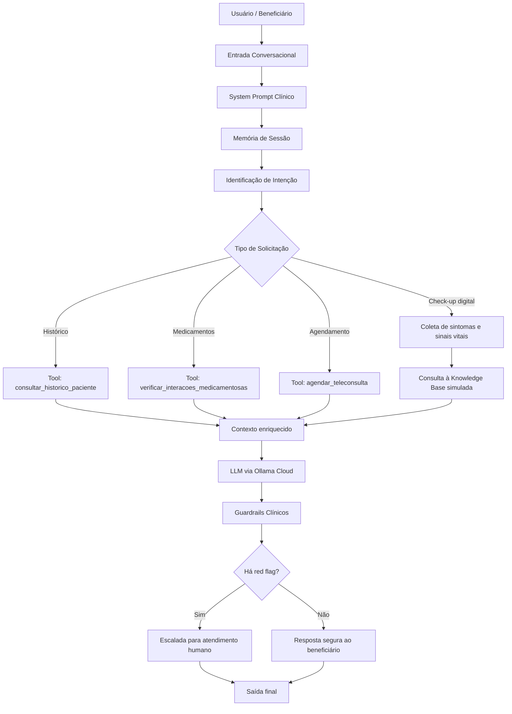

# Arquitetura — BluaDiagnostics Sprint 1

## Fluxograma em Mermaid

## Descrição

A arquitetura proposta simula um agente conversacional de apoio ao check-up digital. O fluxo começa com a entrada do beneficiário, passa pelo system prompt clínico, mantém memória de sessão, utiliza tools simuladas, consulta uma knowledge base inicial e retorna uma resposta segura com guardrails.

## Componentes

- **System Prompt Clínico:** define papel, escopo, restrições, formato de saída e escalada humana.
- **Memória de sessão:** preserva contexto entre turnos.
- **Roteamento de intenção:** identifica se o usuário precisa de check-up, histórico, verificação medicamentosa ou agendamento.
- **Tools simuladas:** representam integrações externas.
- **Knowledge Base:** documentos simulados para futura implementação de RAG.
- **Guardrails:** impedem diagnóstico definitivo, prescrição e respostas fora do escopo.
- **Human-in-the-loop:** decisões clínicas e prescrições dependem de profissional humano.
