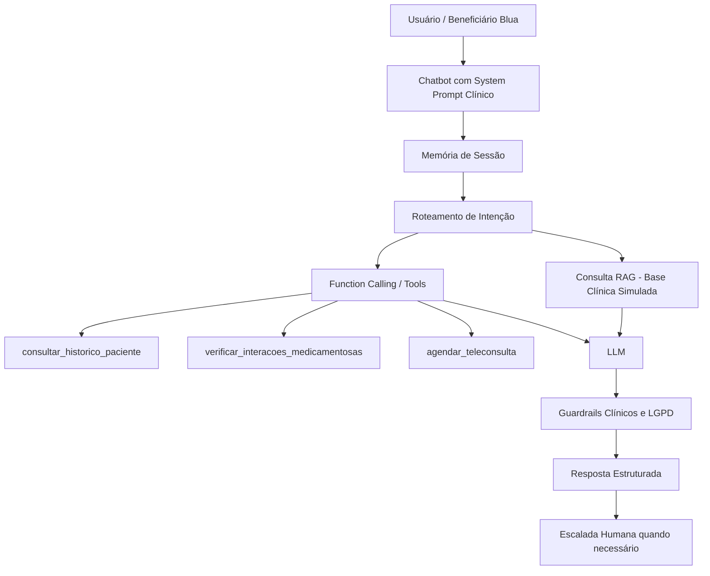

# Arquitetura — BluaDiagnostics Sprint 1

## Descrição

O BluaDiagnostics recebe a mensagem do beneficiário, aplica o system prompt clínico, mantém memória de sessão e decide se precisa consultar tools simuladas. A resposta final é validada por guardrails clínicos, com foco em não diagnosticar, não prescrever sem médico e escalar casos de risco.
